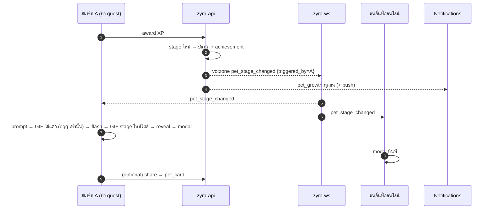

# Room Pet — Evolution flow (XP เต็ม → ข้าม stage) ใครเห็นอะไร แจ้งเตือนใคร

> สถานะ (อัปเดต 2026-09-06 รอบ 47 · app #288): **implement แล้วบน develop** (api #77/#79/#85 · ws #29+ · app #252/#260/#287) · เขียน 2026-09-06 จากโค้ดจริง ไม่ใช่ spec · ลองกดดูได้ที่ `/dev/room-pet-preview` → section "Evolution flow" · หน้า preview อ่านง่าย: [Room Pet Evolution Flow (artifact)](https://claude.ai/code/artifact/31179fdf-e705-49fb-aef5-5440bf0c18b8)

## 1. จุดเริ่ม

ทุก award XP (quest ใด ๆ) → `RoomPetXPService.Award` คำนวณ stage จาก XP รวม · ถ้า `newStage != last_seen_stage` → อัปเดต `last_seen_stage`, รีเซ็ต `last_milestone`, บันทึก `tb_room_pet_achievement` (`first_hatch` เมื่อ egg→baby, `fully_evolved` เมื่อ →evolved) แล้วยิง 2 ทาง: Redis `vo:zone` เหตุการณ์ `pet_stage_changed {map_id, pet_id, stage, prev_stage, xp, triggered_by}` และ notification (ข้อ 3)

| ขั้น | threshold (default config) | หมายเหตุ |
|---|---|---|
| egg → baby | 100 XP | SC-PET-04 "ฟัก" · achievement `first_hatch` |
| baby → adult | 500 XP | SC-PET-05 |
| adult → evolved | 1,000 XP | SC-PET-05 · `fully_evolved` · หลังจากนี้ MAX/prestige |

## 2. ใครเห็นอะไร (real-time)

ws `BroadcastZoneEvent` ส่ง `pet_stage_changed` ให้**ทุก client ที่ต่ออยู่กับ workspace** (ทุกชั้น) · client เช็ค `isPetStageAdvance` (admin ยก threshold จน stage ถอย → เงียบ)

| | คนที่ XP ทำให้ข้าม (`triggered_by === me`) | คนอื่นที่เปิด VO อยู่ | คนที่ไม่ออนไลน์ |
|---|---|---|---|
| หน้าจอ | `PetEvolutionOverlay` เต็มจอ: **prompt** (คลิกก่อน · ตัวปัจจุบันเคลื่อนไหววน: ไข่ Wobbling / Happy · กรอบ 240px) → **playing** GIF ไข่แตก 3.6 วิ (เฉพาะ egg → baby) → **flash** 0.9 วิ → **arriving** GIF ของ stage ใหม่โผล่ 1.2 วิ (ไม่มี GIF → ข้าม) → **reveal** ตัวใหม่นั่งลง (Sitting 1 รอบ) แล้ว Happy วน จนคลิก → **modal** | **modal** ทันที | ไม่มี |
| ขนาด/รูป | รูปนิ่ง = Happy เฟรมแรก (นั่งหันหน้ามา · ไข่ = Wobbling) 240px (รอบ 48 ลดจาก 320) · GIF ทั้งสองวาดในกรอบ 816px = `PET_EVOLUTION_GIF_SCALE` 3.4× (ตัวสัตว์ใน GIF 960² กินแค่ ~26–32 % ของผืน) ตัดส่วนล้น → ตัวสัตว์ขนาดเท่ากันตลอด | modal รูป Happy 112px | — |
| Esc | ข้ามไป modal (ไม่ปิด) | — | — |
| บนแมพ | sprite/ป้าย/วง/panel เปลี่ยนเป็น stage ใหม่ทันที (จาก `pet_xp_changed` → XP) | เหมือนกัน | เห็นตอนเข้าครั้งหน้า |

Modal (`pet-evolution-modal.tsx`): "สัตว์เลี้ยงของคุณเติบโตแล้ว" · "{ชื่อ} เติบโตเข้าสู่ช่วงวัยถัดไปแล้ว…" · XP bar `{xp} / {max} XP` · ปุ่ม **แชร์ให้เพื่อน** (DM/กลุ่ม/แชนเนล → `pet_card` message) · **ตกลง** (ปิด + refetch pets)

## 3. การแจ้งเตือน (SC-PET-07) — ของจริง

ทั้งหมดเป็นแถวใน `tb_notification` (+ `room_pet_id`) และ push สดผ่าน `vo:notify` เข้ากระดิ่ง · **ไม่มี banner/toast** (มีเฉพาะ `zone_force_unclaimed` และ `announcement`) · **ไม่มีอีเมล** (`email_suppressed = true`) · กรองด้วย setting `notification_settings.pet_activity` (default เปิด)

| ประเภท | เมื่อไหร่ | ส่งให้ | ข้อความ (th) | กดแล้ว |
|---|---|---|---|---|
| `pet_growth` | ข้าม stage | **ทุกสมาชิก + owner** ของ workspace | `{name} ฟักออกมาแล้ว! มาดูกันเลย 🐣` / `โตขึ้นแล้ว! 🌱` / `วิวัฒนาการแล้ว! ยินดีด้วยกับทีม ✨` | เดินไปหา pet (ข้ามชั้นผ่าน /loading ได้) + เปิด panel · pet ถูกลบ → toast "สัตว์เลี้ยงตัวนั้นไม่อยู่แล้ว" |
| `pet_milestone` | ถึง 50/75/90 % ของ stage ถัดไป (award เดียวข้ามหลาย % → ส่งแค่สูงสุด) | ทุกสมาชิก + owner | `{name} เดินทางไปถึง {percent}% ของช่วงวัยถัดไปแล้ว` | เหมือนกัน |
| `pet_reminder` | 09:00 ICT ทุกวัน (cron ใน api) | **resident ของห้อง**ที่วันนี้ยังไม่มี xp_event กับ pet ตัวนั้น · วันละครั้ง | `{name} รอให้คุณมาเยี่ยมอยู่นะ 🐾` | เหมือนกัน |

กฎ: stage change ชนะ milestone ใน award เดียวกัน · notification ล่ม pet ยังโต (best-effort, log error)

## 4. ลำดับ

## 5. ช่องว่าง / ต้องเคาะ

- ~~GIF Evolution มีเฉพาะ egg~~ **ผิด (แก้รอบ 47):** ทุก type จริงมี GIF ครบ 4 stage แต่คนละความหมาย — egg = ท่าออก (ไข่โยก→ร้าว→ระเบิด, 24 เฟรม) · baby/adult/evolved = ท่าเข้า (แสง→เงา→ตัวจริง, 8 เฟรม) → โค้ดเล่น GIF ออกเฉพาะ egg แล้วต่อด้วย GIF เข้าของ stage ใหม่ทุกขั้น · ถ้าอยากมี "ท่าออก" ของ baby/adult ต้องเพิ่ม slot ใหม่ใน Pet Management
- **ขนาด GIF เทียบรูปนิ่ง** เป็นค่าคงที่ 3.4× จากการวัด asset จริง — GIF ใหม่ที่วางตัวสัตว์ต่างสัดส่วนมากจะเพี้ยน ควรเขียนข้อกำหนดผืน 960² / ตัวสัตว์ ~30 % ไว้ใน Pet Management
- **หน้าโชว์** `/dev/preview/room-pat` เป็น public (ไม่ต้อง login, fixture ล้วน) — บน dev/uat ต้อง build ด้วย `NEXT_PUBLIC_ROOM_PET=true` ไม่งั้น overlay ไม่แสดง (หน้าจะขึ้นแถบเตือน)
- คนไม่ออนไลน์เห็นแค่กระดิ่ง ไม่มี replay animation — ตามดีไซน์ §6 แต่ PM ยังไม่ได้ยืนยัน
- ไม่มีเสียง/effect บนแมพสำหรับคนที่ไม่ได้ดู modal
- ยังไม่ได้เทส end-to-end ในเบราว์เซอร์ (login ติด) — harness เล่นได้ทั้ง 2 มุมมองด้วยชีทจริง
